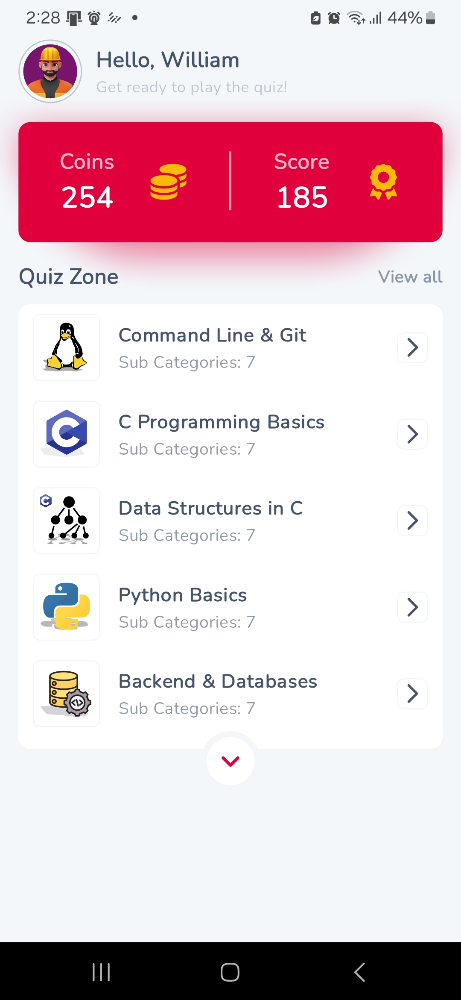

# Holberton Quiz App

Monorepo containing:

- **Backend:** CodeIgniter 3 REST API — see [`backend/index.php`](backend/index.php) and [`REST_Controller`](backend/application/libraries/REST_Controller.php).  
- **Mobile app:** Flutter frontend — entry at [`main()`](flutter_app/lib/main.dart) and root widget [`MyApp`](flutter_app/lib/app/app.dart).

---


### Home Screen


### Challenges Screen


### Quiz Screen


## Table of Contents

- [Overview](#overview)
- [Quickstart](#quickstart)
  - [Backend (CodeIgniter 3)](#backend-codeigniter-3)
  - [Frontend (Flutter)](#frontend-flutter)
- [Configuration](#configuration)
- [Useful Files & Symbols](#useful-files--symbols)
- [Troubleshooting](#troubleshooting)
- [Contributing & License](#contributing--license)

---

## Overview

This project provides a **Flutter-based quiz client** and a **CodeIgniter 3 REST API backend**.  
The Flutter app communicates with the backend API endpoints exposed by CodeIgniter controllers.

---

Here’s your content converted to properly formatted Markdown:

````markdown
## Quickstart

### Backend (CodeIgniter 3)

1. Install **PHP** and **Composer**.
2. From the repo root, navigate to the backend and install dependencies:

```bash
cd backend
composer install
````

3. Configure database and app settings:

   * Edit `database.php`
   * Edit `config.php`
   * Edit API settings in `rest.php`

4. Serve the API (development):

```bash
php -S localhost:8000 -t backend
```

Or deploy under Apache/Nginx.

**Notes:**

* CodeIgniter version is declared in `CI_VERSION`.
* Custom REST behavior lives in `REST_Controller`.
* Main API controller example: `Api.php`.

---

### Frontend (Flutter)

1. Install Flutter SDK and required platform tooling (Android Studio / Xcode).
2. From the repo root, install dependencies:

```bash
cd flutter_app
flutter pub get
```

3. Configure Firebase or platform-specific files:

   * Android: `google-services.json` (if used)
   * iOS: configure `GoogleService-Info.plist` in Xcode if needed

4. Set API base URL:

   * Update API/host constants in `constants.dart`

5. Run the app:

   * Entry point: `main()`
   * Routing: `Routes`
   * Root widget: `MyApp`
   * System config: `SystemConfigCubit`

---

### Configuration

**Backend config files:**

* `config.php`
* `database.php`
* `rest.php`

**Flutter config & secrets:**

* `firebase_options.dart`
* `google-services.json` (Android)

---

### Useful Files & Symbols

**Backend:**

* API entry: `index.php`
* REST controller library: `REST_Controller`
* Main API controller: `Api.php`
* App config: `config.php`
* Database config: `database.php`

**Flutter:**

* App entry: `main()`
* Root widget: `MyApp`
* Routes: `Routes`
* System config cubit: `SystemConfigCubit`
* Assets constants: `Assets`
* Pubspec: `pubspec.yaml`

---

### Troubleshooting

* **Backend 500 / CI errors:** check PHP error logs and verify database credentials in `database.php`.
* **Flutter build errors:** run `flutter doctor` to ensure Android/iOS toolchains are installed. Clean build:

```bash
flutter clean
flutter pub get
```

* **API URL mismatch:** confirm the base URL in `constants.dart` matches the server address.

---

### Contributing & License

* Follow standard Git workflow: create issues and PRs.
* Licenses for vendor libraries live in their respective folders (`vendor` and `flutter_app/pubspec.yaml`).

